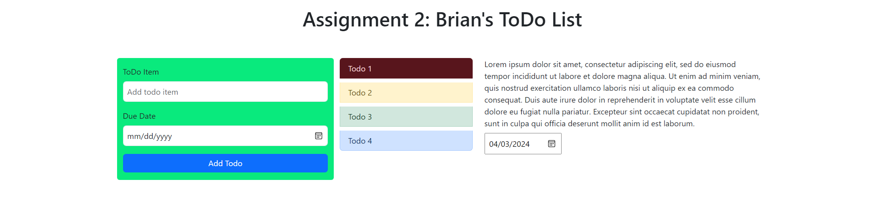

# Assignment2

# Assignment Description

In this assignment, you are required to create a ToDo List application using React and Bootstrap. The application will display a list of ToDo items, each with a title, description, and due date. The ToDo items will be displayed in a ListGroup and Tab interface, where the ListGroup will contain the titles of the ToDo items and the Tab will contain the descriptions and due dates of the ToDo items. The ToDo items will be color-coded based on their due dates.

# Requirements

1. **Setup:** Create a new React application and install the `react-bootstrap` library.

2. **Data:** Create a static array of ToDo items. Each ToDo item should be an object with the following properties: `title`, `description`, and `dueDate`.  Some content has been provided for you in `todoItems.js`.  

3. **ListGroup:** Use the `ListGroup` component from `react-bootstrap` to display the titles of the ToDo items. Each `ListGroup.Item` should be linked to a corresponding `Tab.Pane`.

4. **Tab:** Use the `Tab` component from `react-bootstrap` to display the descriptions and due dates of the ToDo items. Each `Tab.Pane` should be controlled by a corresponding `ListGroup.Item`.

5. **Color Coding:** Create a function that determines the color of a ToDo item based on its due date. The function should return a string that corresponds to one of the Bootstrap color variants (e.g., 'danger', 'warning', 'success', 'primary'). Use this function to apply a color to each `ListGroup.Item`.  The variants need to align with the following logic:
    * primary:due date > 7 days
    * success:due date < 7 days
    * warning:due date < 4 days
    * danger:due date < 2 days

6. **Editable Items:** Make the descriptions, and due dates of the ToDo items editable. For description, use the `contentEditable` attribute to achieve this.  For the due date use a date input.

7. **Header:** Add a header to the application with the text "Assignment 2: `Your Name` ToDo List".

8. **Form:** Add a form to the application with fields for adding a new ToDo item. The form should include a text input for the title, a date input for the due date, and a submit button. The form does not need to be functional.

9. **Styling:** All additional styling should be kept in a separate CSS file and imported into your application

# Tips

* Use the `Container`, `Row`, and `Col` components from `react-bootstrap` to layout your components.
* Use the `Form` and `Button` components from `react-bootstrap` to create the form.
* Use the `Tab.Container`, `Tab.Content`, and `Tab.Pane` components from `react-bootstrap` to create the Tab interface.
* Use the `ListGroup` and `ListGroup.Item` components from `react-bootstrap` to create the ListGroup interface.
* Use the `eventKey` prop and `href` prop to link the `ListGroup.Item` components to the `Tab.Pane` components.
* Use the `variant` prop to apply the color to the `ListGroup.Item` components.
* Use the `contentEditable` attribute to make the descriptions, and due dates editable.

# Resources
* [React Documentation](https://react.dev/learn)
* [React Bootstrap Documentation](https://react-bootstrap.github.io/docs/getting-started/introduction)
* [CSS Documentation](https://developer.mozilla.org/en-US/docs/Web/CSS)
